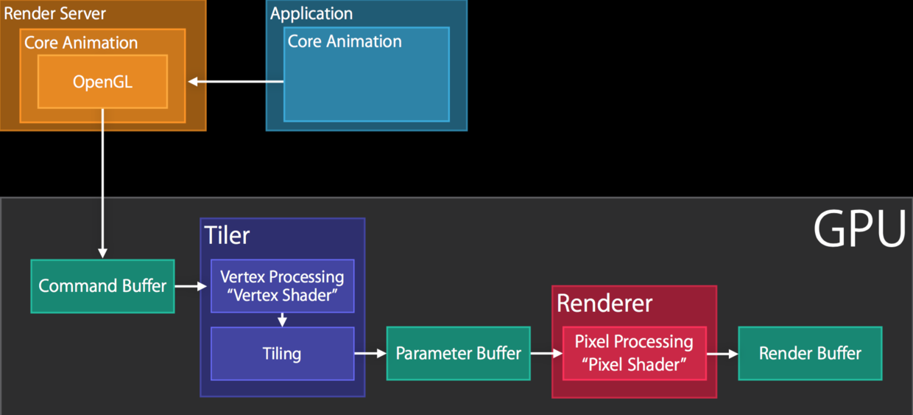
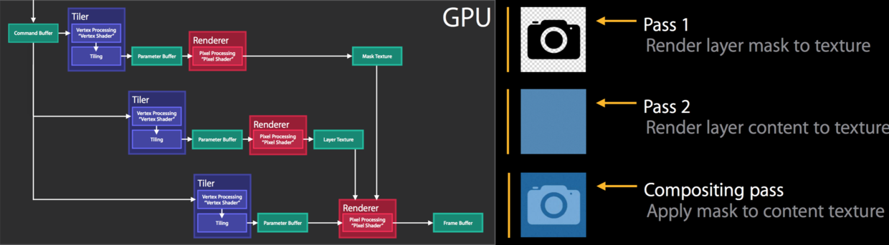

### 读书笔记（一）


#### 一、instancetype 和 id 作为初始化实例 返回值的不同

<!--more-->

Objective-C的一些使用惯例不仅仅是好的编程习惯，更是给编译器的隐藏指令。
例如， alloc 和 init 的返回类型都是 id ，然而在Xcode中，编译器会检查所有正确类型。它是怎么做到的呢？
在Cocoa中，约定 alloc 或 init 的方法总是返回接收器类实例的对象。据说这些方法有一个相关返回类型。
虽然类构造方法也是返回 id ，但是类构造方法并没有做同样的类型检查，因为它们不遵循命名规范。
你可以自己试着这样：


    [[[NSArray alloc] init] mediaPlaybackAllowsAirPlay]; // ❗ "No visible @interface for `NSArray` declares the selector `mediaPlaybackAllowsAirPlay`"

    [[NSArray array] mediaPlaybackAllowsAirPlay]; // (No error)
由于alloc 和 init 作为相关返回类型遵循命名规范，执行对NSArray的正确类型检查。然而，等价类构造函数array不遵循命名规范，它被认为是id类型。
id类型对禁用类型安全性检查非常有用，但当你确实需要它的时候却没有时，情况会变得非常糟糕。
另一种显示声明返回类型（在之前例子中的 (NSArray *)）的方式有了稍微的改进，但是它不利于子类的发挥。
所以编译器从这里介入以解决Objective-C类型系统的这个永恒边界情况：
instancetype 关键字，它可以表示一个方法的相关返回类型。例如：

    @interface Person
    +(instancetype)personWithName:(NSString *)name;
    @end
* instancetype 与 id 不一样, instancetype 只能在方法声明中作为返回类型使用。

使用 instancetype ，编译器将正确的推断出 +personWithName: 是 Person 的一个实例。
为了在不久的将来使用 instancetype ，你可以在Foundation中查找类构造函数。例如UICollectionViewLayoutAttributes 就已经正在使用 instancetype 了。

### 二、iOS为什么不要在init初始化方法里调用self.view

首先.如果你调用self.view的时候,就会调用view的getter方法, 这个时候,view是空的,那么系统就会自动给你创建一个view,然后就会触发ViewDidLoad方法.那么这个时候,如果你init方法里有数组初始化.但是你还没走到那步,而直接就给数组赋值了,那么这个值赋值给了一个不存在的数组.这样就容易出现错误.所以,尽量不要在init方法里写可视化控件的语句.

### 三、忽略编译警告

如果你知道你的代码不会导致内存泄露，你可以通过加入这些代码忽略这些警告

    #pragma clang diagnostic push
    #pragma clang diagnostic ignored "-Warc-performSelector-leaks"

    [myObj performSelector:mySelector withObject:name];

    #pragma clang diagnostic pop
    
注意我们是如何在相关代码上下文中用 pragma 停用 -Warc-performSelector-leaks 检查的。这确保我们没有全局禁用。如果全局禁用，可能会导致错误。

使用 #pragma unused():忽略没用使用变量的编译警告

    -(NSInteger)giveMeFive
    {
        NSString *foo;
        #pragma unused (foo)

        return 5;
    }

### 四、Block的深入学习

#### 一些关键点：

    block 是在栈上创建的
    block 可以复制到堆上
    Block会捕获栈上的变量(或指针)，将其复制为自己私有的const(变量)。
    (如果在Block中修改Block块外的)栈上的变量和指针，那么这些变量和指针必须用__block关键字申明(译者注：否则就会跟上面的情况一样只是捕获他们的瞬时值)。
    block 可以声明成全局静态的
如果 block 没有在其他地方被保持，那么它会随着栈生存并且当栈帧（stack frame）返回的时候消失。仅存在于栈上时，block对对象访问的内存管理和生命周期没有任何影响。

如果 block 需要在栈帧返回的时候存在，它们需要明确地被复制到堆上，这样，block 会像其他 Cocoa 对象一样增加引用计数。当它们被复制的时候，它会带着它们的捕获作用域一起，retain 他们所有引用的对象。

如果一个 block引用了一个栈变量或指针，那么这个block初始化的时候会拥有这个变量或指针的const副本，所以(被捕获之后再在栈中改变这个变量或指针的值)是不起作用的。(译者注：所以这时候我们在block中对这种变量进行赋值会编译报错:Variable is not assignable(missing __block type specifier)，因为他们是副本而且是const的.具体见下面的例程)。

当一个 block 被复制后，__block 声明的栈变量的引用被复制到了堆里，复制完成之后，无论是栈上的block还是刚刚产生在堆上的block(栈上block的副本)都会引用该变量在堆上的副本。

(下面代码是译者加的)

    ...
    CGFloat blockInt = 10;
    void (^playblock)(void) = ^{
        NSLog(@"blockInt = %zd", blockInt);
    };
    blockInt ++;
    playblock();
    ...

    //结果为:blockInt = 10


最重要的事情是 __block 声明的变量和指针在 block 里面是作为显示操作真实值/对象的结构来对待的。

block 在 Objective-C 的 runtime(运行时) 里面被当作一等公民对待：他们有一个 isa 指针，一个类也是用 isa 指针在Objective-C 运行时来访问方法和存储数据的。在非 ARC 环境肯定会把它搞得很糟糕，并且悬挂指针会导致 crash。__block 仅仅对 block 内的变量起作用，它只是简单地告诉 block：

    嗨，这个指针或者原始的类型依赖它们在的栈。请用一个栈上的新变量来引用它。我是说，请对它进行双重解引用，不要 retain 它。 谢谢，哥们。

如果在定义之后但是 block 没有被调用前，对象被释放了，那么 block 的执行会导致 crash。 __block 变量不会在 block 中被持有，最后... 指针、引用、解引用以及引用计数变得一团糟。

#### self 的循环引用

当使用代码块和异步分发的时候，要注意避免引用循环。 总是使用 weak 来引用对象，避免引用循环。（译者注：这里更为优雅的方式是采用影子变量@weakify/@strongify 这里有更为详细的说明） 此外，把持有 block 的属性设置为 nil (比如 self.completionBlock = nil) 是一个好的实践。它会打破 block 捕获的作用域带来的引用循环。

例子:

    __weak __typeof(self) weakSelf = self;
    [self executeBlock:^(NSData *data, NSError *error) {
        [weakSelf doSomethingWithData:data];
    }];

不要这样:

    [self executeBlock:^(NSData *data, NSError *error) {
        [self doSomethingWithData:data];
    }];

多个语句的例子:

    __weak __typeof(self)weakSelf = self;
    [self executeBlock:^(NSData *data, NSError *error) {
        __strong __typeof(weakSelf) strongSelf = weakSelf;
        if (strongSelf) {
            [strongSelf doSomethingWithData:data];
            [strongSelf doSomethingWithData:data];
        }
    }];

不要这样:

    __weak __typeof(self)weakSelf = self;
    [self executeBlock:^(NSData *data, NSError *error) {
        [weakSelf doSomethingWithData:data];
        [weakSelf doSomethingWithData:data];
    }];

你应该把这两行代码作为 snippet 加到 Xcode 里面并且总是这样使用它们。

    __weak __typeof(self)weakSelf = self;
    __strong __typeof(weakSelf)strongSelf = weakSelf;

这里我们来讨论下 block 里面的 self 的 __weak 和 __strong 限定词的一些微妙的地方。简而言之，我们可以参考 self 在 block 里面的三种不同情况。

    直接在 block 里面使用关键词 self
    在 block 外定义一个 __weak 的 引用到 self，并且在 block 里面使用这个弱引用
    在 block 外定义一个 __weak 的 引用到 self，并在在 block 内部通过这个弱引用定义一个 __strong 的引用。

方案 1. 直接在 block 里面使用关键词 self

如果我们直接在 block 里面用 self 关键字，对象会在 block 的定义时候被 retain，（实际上 block 是 copied 但是为了简单我们可以忽略这个）。一个 const 的对 self 的引用在 block 里面有自己的位置并且它会影响对象的引用计数。如果这个block被其他的类使用并且(或者)彼此间传来传去，我们可能想要在 block 中保留 self，就像其他在 block 中使用的对象一样. 因为他们是block执行所需要的.

    dispatch_block_t completionBlock = ^{
        NSLog(@"%@", self);
    }

    MyViewController *myController = [[MyViewController alloc] init...];
    [self presentViewController:myController
                    animated:YES
                    completion:completionHandler];

没啥大不了。但是如果通过一个属性中的 self 保留 了这个 block（就像下面的例程一样）,对象( self )保留了 block 会怎么样呢？

    self.completionHandler = ^{
        NSLog(@"%@", self);
    }

    MyViewController *myController = [[MyViewController alloc] init...];
    [self presentViewController:myController
                    animated:YES
                    completion:self.completionHandler];

这就是有名的 retain cycle, 并且我们通常应该避免它。这种情况下我们收到 CLANG 的警告：

    Capturing 'self' strongly in this block is likely to lead to a retain cycle （在 block 里面发现了 `self` 的强引用，可能会导致循环引用）

所以 __weak 就有用武之地了。

方案 2. 在 block 外定义一个 __weak 的 引用到 self，并且在 block 里面使用这个弱引用

这样会避免循坏引用，也是通常情况下我们的block作为类的属性被self retain 的时候会做的。

    __weak typeof(self) weakSelf = self;
    self.completionHandler = ^{
        NSLog(@"%@", weakSelf);
    };

    MyViewController *myController = [[MyViewController alloc] init...];
    [self presentViewController:myController
                    animated:YES
                    completion:self.completionHandler];

这个情况下 block 没有 retain 对象并且对象在属性里面 retain 了 block 。所以这样我们能保证了安全的访问 self。 不过糟糕的是，它可能被设置成 nil 的。问题是：如何让 self 在 block 里面安全地被销毁。

考虑这么个情况：block 作为属性(property)赋值的结果，从一个对象被复制到另一个对象(如 myController)，在这个复制的 block 执行之前，前者（即之前的那个对象）已经被解除分配。

下面的更有意思。

方案 3. 在 block 外定义一个 __weak 的 引用到 self，并在在 block 内部通过这个弱引用定义一个 __strong 的引用

你可能会想，首先，这是避免 retain cycle 警告的一个技巧。

这不是重点，这个 self 的强引用是在block 执行时 被创建的，但是否使用 self 在 block 定义时就已经定下来了， 因此self (在block执行时) 会被 retain.

Apple 文档 中表示 "为了 non-trivial cycles ，你应该这样" ：

    MyViewController *myController = [[MyViewController alloc] init...];
    // ...
    MyViewController * __weak weakMyController = myController;
    myController.completionHandler =  ^(NSInteger result) {
        MyViewController *strongMyController = weakMyController;
        if (strongMyController) {
            // ...
            [strongMyController dismissViewControllerAnimated:YES completion:nil];
            // ...
        }
        else {
            // Probably nothing...
        }
    };

首先，我觉得这个例子看起来是错误的。如果 block 本身在 completionHandler 属性中被 retain 了，那么 self 如何被 delloc 和在 block 之外赋值为 nil 呢? completionHandler 属性可以被声明为 assign 或者 unsafe_unretained 的，来允许对象在 block 被传递之后被销毁。

我不能理解这样做的理由，如果其他对象需要这个对象（self），block 被传递的时候应该 retain 对象，所以 block 应该不被作为属性存储。这种情况下不应该用 __weak/__strong

总之，其他情况下，希望 weakSelf 变成 nil 的话，就像第二种情况解释那么写（在 block 之外定义一个弱应用并且在 block 里面使用）。

还有，Apple的 "trivial block" 是什么呢。我们的理解是 trivial block 是一个不被传送的 block ，它在一个良好定义和控制的作用域里面，weak 修饰只是为了避免循环引用。

虽然有 Kazuki Sakamoto 和 Tomohiko Furumoto) 讨论的 一 些 的 在线 参考, Matt Galloway 的 (Effective Objective-C 2.0 和 Pro Multithreading and Memory Management for iOS and OS X ，大多数开发者始终没有弄清楚概念。

在 block 内用强引用的优点是，抢占执行的时候的鲁棒性。在 block 执行的时候, 再次温故下上面的三个例子：

方案 1. 直接在 block 里面使用关键词 self

如果 block 被属性 retain，self 和 block 之间会有一个循环引用并且它们不会再被释放。如果 block 被传送并且被其他的对象 copy 了，self 在每一个 copy 里面被 retain

方案 2. 在 block 外定义一个 __weak 的 引用到 self，并且在 block 里面使用这个弱引用

不管 block 是否通过属性被 retain ，这里都不会发生循环引用。如果 block 被传递或者 copy 了，在执行的时候，weakSelf 可能已经变成 nil。

block 的执行可以抢占，而且对 weakSelf 指针的调用时序不同可以导致不同的结果(如：在一个特定的时序下 weakSelf 可能会变成nil)。

    __weak typeof(self) weakSelf = self;
    dispatch_block_t block =  ^{
        [weakSelf doSomething]; // weakSelf != nil
        // preemption, weakSelf turned nil
        [weakSelf doSomethingElse]; // weakSelf == nil
    };

方案 3. 在 block 外定义一个 __weak 的 引用到 self，并在在 block 内部通过这个弱引用定义一个 __strong 的引用。

不管 block 是否通过属性被 retain ，这里也不会发生循环引用。如果 block 被传递到其他对象并且被复制了，执行的时候，weakSelf 可能被nil，因为强引用被赋值并且不会变成nil的时候，我们确保对象 在 block 调用的完整周期里面被 retain了，如果抢占发生了，随后的对 strongSelf 的执行会继续并且会产生一样的值。如果 strongSelf 的执行到 nil，那么在 block 不能正确执行前已经返回了。

    __weak typeof(self) weakSelf = self;
    myObj.myBlock =  ^{
        __strong typeof(self) strongSelf = weakSelf;
        if (strongSelf) {
        [strongSelf doSomething]; // strongSelf != nil
        // preemption, strongSelf still not nil（抢占的时候，strongSelf 还是非 nil 的)
        [strongSelf doSomethingElse]; // strongSelf != nil
        }
        else {
            // Probably nothing...
            return;
        }
    };

在ARC条件中，如果尝试用 -> 符号访问一个实例变量，编译器会给出非常清晰的错误信息：

Dereferencing a __weak pointer is not allowed due to possible null value caused by race condition, assign it to a strong variable first. (对一个 __weak 指针的解引用不允许的，因为可能在竞态条件里面变成 null, 所以先把他定义成 strong 的属性)

可以用下面的代码展示

    __weak typeof(self) weakSelf = self;
    myObj.myBlock =  ^{
        id localVal = weakSelf->someIVar;
    };

在最后

    方案 1: 只能在 block 不是作为一个 property 的时候使用，否则会导致 retain cycle。

    方案 2: 当 block 被声明为一个 property 的时候使用。

    方案 3: 和并发执行有关。当涉及异步的服务的时候，block 可以在之后被执行，并且不会发生关于 self 是否存在的问题。


### 五、IOS高效添加圆角效果

误区一：

    view.layer.cornerRadius = 5
    
该代码经过测试是不会造成内存性能损耗。

    view.layer.masksToBounds = Yes // 遮罩layer层以下的视
    图，使圆角生效
    
这代码才是造成性能损耗的关键因素。由于该代码会导致视图离屏渲染（Color Offscreen-Renderd Yellow）相关文章:[UIKit性能调优实战讲解](http://www.jianshu.com/p/619cf14640f3)

注意事项：我们应该尽量避免重写 drawRect 方法，用CAShapeLayer代替图层绘制。不恰当的使用这个方法

会导致内存暴增。举个例子，iPhone6 上与屏幕等大的 UIView，即使重写一个空的 drawRect 方法，它也

至少占用 750 * 1134 * 4 字节 ≈ 3.4 Mb 的内存。在内存恶鬼drawRect 及其后续中，作者详细介绍了

其中原理，据他测试，在 iPhone6 上空的、与屏幕等大的视图重写 drawRect 方法会消耗 5.2 Mb 内存。

总之，能避免重写 drawRect 方法就尽可能避免。

其次，这种方法本质上是用遮罩层 mask 来实现，因此同样无可避免的会导致离屏渲染。我试着将此前 34 个

视图的圆角改用这种方法实现，结果 fps 掉到 11 左右。已经属于卡出翔的节奏了。

高效设置圆角实战：

#### 为 UIView 添加圆角
这种做法的原理是手动画出圆角。虽然我们之前说过，为普通的视图直接设置 cornerRadius 属性即可。但万一不可避免的需要使用 masksToBounds，就可以使用下面这种方法，它的核心代码如下：

```objc
func kt_drawRectWithRoundedCorner(radius radius: CGFloat,       
                       borderWidth: CGFloat,
                                  backgroundColor: UIColor,
                                  borderColor: UIColor) -> UIImage {    
     UIGraphicsBeginImageContextWithOptions(sizeToFit, false, UIScreen.mainScreen().scale)
     let context = UIGraphicsGetCurrentContext()
     
     CGContextMoveToPoint(context, 开始位置);  // 开始坐标右边开始
     CGContextAddArcToPoint(context, x1, y1, x2, y2, radius);  // 这种类型的代码重复四次
   
     CGContextDrawPath(UIGraphicsGetCurrentContext(), .FillStroke)  
     let output = UIGraphicsGetImageFromCurrentImageContext();
     UIGraphicsEndImageContext();
     return output
}
```

这个方法返回的是 UIImage，也就是说我们利用 Core Graphics 自己画出了一个圆角矩形。除了一些必要的代码外，最核心的就是 CGContextAddArcToPoint 函数。它中间的四个参数表示曲线的起点和终点坐标，最后一个参数表示半径。调用了四次函数后，就可以画出圆角矩形。最后再从当前的绘图上下文中获取图片并返回。
有了这个图片后，我们创建一个 UIImageView 并插入到视图层级的底部：

```objc
extension UIView {
    func kt_addCorner(radius radius: CGFloat,
                      borderWidth: CGFloat,
                      backgroundColor: UIColor,
                      borderColor: UIColor) {
        let imageView = UIImageView(image: kt_drawRectWithRoundedCorner(radius: radius,
                                    borderWidth: borderWidth,
                                    backgroundColor: backgroundColor,
                                    borderColor: borderColor))
        self.insertSubview(imageView, atIndex: 0)
    }
}
```

完整的代码可以在项目中找到，使用时，你只需要这样写：

```objc
let view = UIView(frame: CGRectMake(1,2,3,4))
view.kt_addCorner(radius: 6)
```

#### 为 UIImageView 添加圆角

相比于上面一种实现方法，为 UIImageView 添加圆角更为常用。它的实现思路是直接截取图片：

```objc
extension UIImage {
    func kt_drawRectWithRoundedCorner(radius radius: CGFloat, _ sizetoFit: CGSize) -> UIImage {
        let rect = CGRect(origin: CGPoint(x: 0, y: 0), size: sizetoFit)
         
        UIGraphicsBeginImageContextWithOptions(rect.size, false, UIScreen.mainScreen().scale)
        CGContextAddPath(UIGraphicsGetCurrentContext(),
            UIBezierPath(roundedRect: rect, byRoundingCorners: UIRectCorner.AllCorners,
                cornerRadii: CGSize(width: radius, height: radius)).CGPath)
        CGContextClip(UIGraphicsGetCurrentContext())
         
        self.drawInRect(rect)
        CGContextDrawPath(UIGraphicsGetCurrentContext(), .FillStroke)
        let output = UIGraphicsGetImageFromCurrentImageContext();
        UIGraphicsEndImageContext();
         
        return output
    }
}
````

圆角路径直接用贝塞尔曲线绘制，一个意外的 bonus 是还可以选择哪几个角有圆角效果。这个函数的效果是将原来的 UIImage 剪裁出圆角。配合着这函数，我们可以为 UIImageView 拓展一个设置圆角的方法：

```objc
extension UIImageView {
    /**
     / !!!只有当 imageView 不为nil 时，调用此方法才有效果
     :param: radius 圆角半径
     */
    override func kt_addCorner(radius radius: CGFloat) {
        self.image = self.image?.kt_drawRectWithRoundedCorner(radius: radius, self.bounds.size)
    }
}

```

完整的代码可以在项目中找到，使用时，你只需要这样写：

```objc	
let imageView = let imgView1 = UIImageView(image: UIImage(name: ""))
imageView.kt_addCorner(radius: 6)
```

###  六、UIKit 性能优化 读后总结

原文地址：[UIKit性能调优实战讲解](http://www.jianshu.com/p/619cf14640f3)

#### 首选来说 为什么我们要进行UIKit优化？
直接上图：

 

如图所示，正常情况图层的渲染是通过CPU的计算和GPU的处理完成 正常的渲染流程的。
  * 当CPU和GPU的耗时时间控制在16.67ms之间（如第一部分）图层就会正常渲染。
  * 当CPU和GPU的耗时时间超过了16.67ms（如第二部分）图层渲染就会掉帧，即屏幕就会出现花屏或者卡顿的现象。
所以，为了保证图层的正常渲染以及提高性能，我们着重从缓减CPU 和 GPU 不必要的消耗上，来做优化和调整。

#### 1.为什么要把控件尽量设置成不透明，如果是透明的会有什么影响，如何检测这种影响？

* 影响：如果控件带有透明度，这就会导致其控件与下层的控件的颜色 混合在一块。例如，上层是蓝色（透明度50%），下层是红色，那么最终显示的是紫色。
这种颜色的混合，需要GPU去处理混合的结果，这就一定程度的造成GPU额外的消耗。当实际层次更加复杂的时候（三层，五层）,GPU的消耗更加明显，对性能的影响就很明显了。如果将最上层的透明度设置为1，这样GPU就会忽略该层下面所有层次，节约了不必要的计算，从而提升性能。
* 检测：检测步骤，通过苹果自带的软件instruments中的core animation 选项 -> 选择color Blended Layers 选项 红色区域就是透明度的设置.
* 优化措施：
   - opaque = true 当然这个UIView默认就是 true的
   - alpha = 1 透明度尽量设置为1
   - 最重要的是要设置背景颜色与父类一直,如果不设置默认会是透明的，另外clearColor（背景色透明）也不能设置，。label.backgroundColor = UIColor.WhiteColor()
   
#### 4.离屏渲染
离屏渲染就是相对于正常的渲染流程（将图层直接合成到帧的缓冲区中），增加了一个额外的步骤（先创建屏幕外缓冲区，然后渲染到文理中，最后将结果渲染到帧的缓冲区），这个步骤中需要GPU额外的处理计算，造成很大消耗，所以俗称：离屏渲染。
我们先看看正常的渲染通道（Render-Pass）：
 
正常的渲染是OpenGL 提交一个命令到 command buff ，随后GPU 进行渲染 ，然后将渲染结果合成到（render buff）帧缓冲区中。
但是复杂的效果无法直接渲染出结果，需要分布渲染最后组合起来，比如添加一个蒙版（mask）：

如图所示，渲染流程中，分为好几部分进行的。在前两个渲染通道中，GPU分别得到纹理（texture，也就是相机图标）和layer(蓝色的蒙版)的渲染
结果。但这两个渲染结果没有直接放到render buff（帧缓冲区中），也就是发生了离屏渲染，知道第三个渲染通道，才把两者结合起来放入 render buff （帧缓冲区中）。离屏渲染实际上就是将渲染结果临时保存起来，等到用的时候再取出来，因此相对于普通渲染占用资源。
以下情况可能会导致离屏渲染:

```
1.重写drawRect 方法。（一般情况下画图都用CAShapeLayer）
2.有mask（圆角）或者阴影（layer.masksToBounds，layer.shadow），模糊效果也是一种mask (当使用圆角或者阴影是最好开启光栅化以达到缓冲的
效果)
3.光栅化 layer.shouldRasterize = true
```

#### 3. 光栅化
所谓光栅化其实就是将一个layer预先渲染成位图(bitmap)，然后加入缓存中。如果对于阴影效果这样的比较消耗资源的静态内容进行缓存、
可以得到一定幅度的性能提升。

```objc
label.layer.shouldRasterize = true
```

缓冲中的对象有效期只有100ms（0。1s）如果超过这个时间缓存会自动清理。光栅化是把双刃剑，先写入缓存再读取会消耗一定的时间，因此在没有必要的情况下尽量不要使用。除非碰到很复杂、静态的效果才能使用。会导致离屏渲染。
### 4.图片大小
尽量保持图片的大小合适，以及图片的格式 GPU所支持。如果图片偏大偏小，都需要GPU额外的去计算处理造成GPU的消耗，从而增加处理时间。
而图片的格式如果GPU 不支持的话同样需要GPU去做额外的转化，消耗大量的时间。


