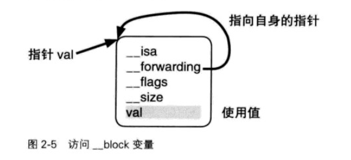
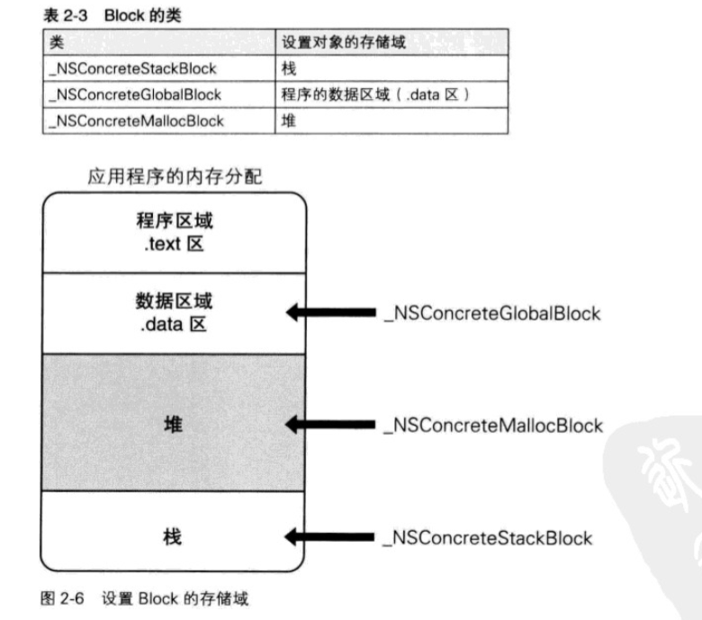
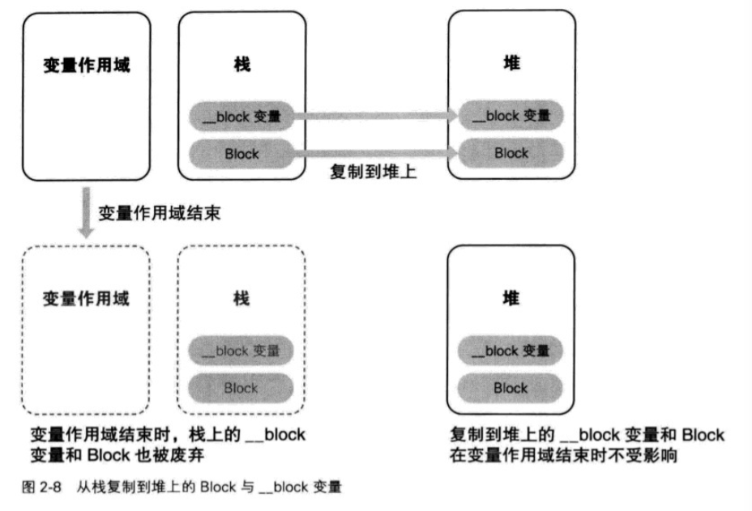
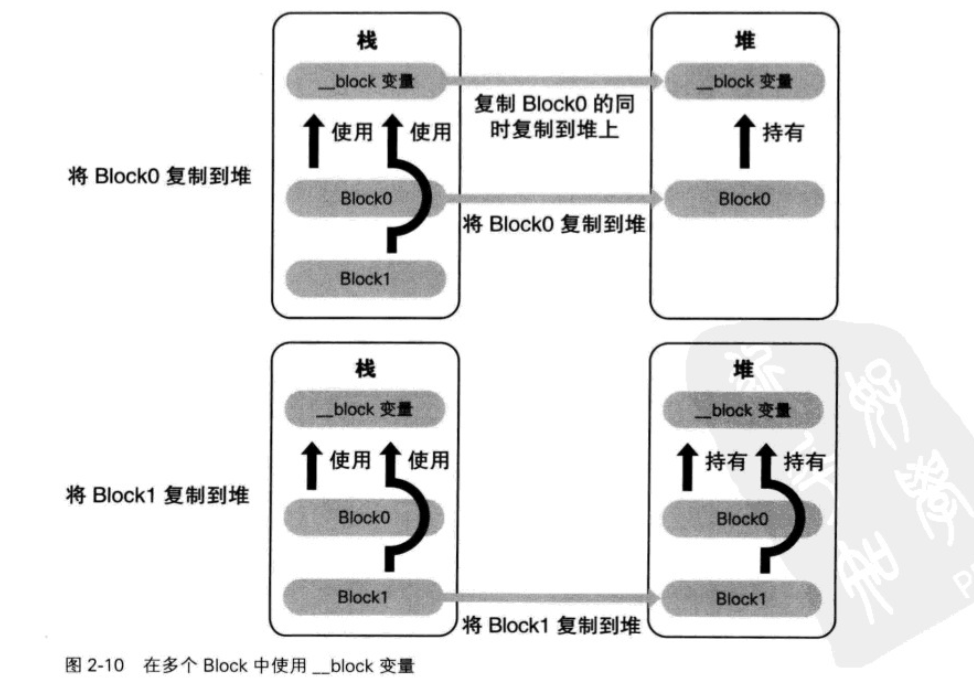
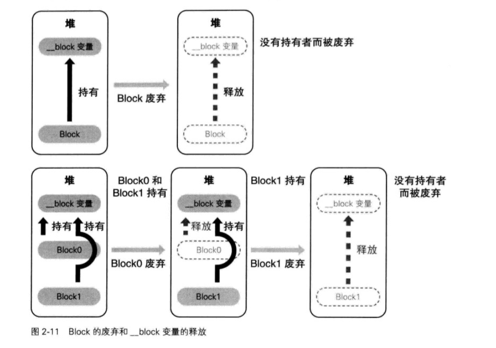

### Block源码解析和深入理解

#### Block的本质
Block是"带有自动变量值的匿名函数".
我们通过Clang（LLVM编译器）来将OC的代码转换成C++源码的形式，通过如下命令：

    clang -rewrite-objc 源代码文件名
    
下面，我们要转换的Block语法

```objc
int main(int argc, const char * argv[]) {
    void (^blk)(void) = ^{
        printf("Block\n");
    };
    blk();
    return 0;
}
```
该源代码通过Clang 可变换为以下形式：

```objc
/*
    __block_impl （block）结构体声明
*/
struct __block_impl {
  void *isa; // isa 指针，指向父类的实例。void * 相当于 id 是个实例。
  int Flags; // 
  int Reserved;
  void *FuncPtr; //函数指针 指向block代码块的实现函数
};
/*
    __main_block_impl_0 匿名的block 结构体声明和实现
*/
struct __main_block_impl_0 {
  struct __block_impl impl;//block 的结构体实例
  struct __main_block_desc_0* Desc; //block des的指针 指向block的详情
  /*
    __main_block_impl_0 结构体构造函数实现
  */
  __main_block_impl_0(void *fp, struct __main_block_desc_0 *desc, int flags=0) {
    impl.isa = &_NSConcreteStackBlock; // 初始化 block 实例属性 isa ，表示该block 是 _NSConcreteStackBlock (栈)类型的代码块
    impl.Flags = flags;
    impl.FuncPtr = fp;// block 具体的函数实现指针
    Desc = desc;//desc 指针
  }
};
/*
     匿名block 具体的函数实现
*/
static void __main_block_func_0(struct __main_block_impl_0 *__cself) {

        printf("Block\n");
    }
/*
    匿名block desc 指针的具体函数实现，对block（__main_block_impl_0） 结构体实例的大小进行初始化
*/
static struct __main_block_desc_0 {
  size_t reserved; // 升级所需区域
  size_t Block_size;//block 实际内存大小
} __main_block_desc_0_DATA = { 0, sizeof(struct __main_block_impl_0)};

/*
    把多余的转换去掉，看起来就比较清楚了：
    第一部分：block的初始化
    __main_block_func_0: 参数一 是block语法转换的C语言函数指针。
    __main_block_desc_0_DATA： 参数二 作为静态全局变量初始化的 __main_block_desc_0 结构体实例指针
    struct __main_block_impl_0 tmp = __main_block_impl_0(__main_block_func_0, &__main_block_desc_0_DATA);
    struct __main_block_impl_0 *blk = &tmp;
    第二部分：
    block的执行： blk()
    去掉转化部分：
       (*blk -> imp.FuncPtr)(blk);
    这就是简单地使用函数指针调用函数。由Block语法转换的 __main_block_func_0 函数的指针被赋值成员变量FuncPtr中，另外 __main_block_func_0的函数的参数 __cself 指向Block的值，通过源码可以看出 Block 正式作为参数进行传递的。
*/
int main(int argc, const char * argv[]) {
    void (*blk)(void) = ((void (*)())&__main_block_impl_0((void *)__main_block_func_0, &__main_block_desc_0_DATA));
    ((void (*)(__block_impl *))((__block_impl *)blk)->FuncPtr)((__block_impl *)blk);
    return 0;
}

```
针对源码的解释 大部分在代码中都注释了。需要特别指出的是：

    static void __main_block_func_0(struct __main_block_impl_0 *__cself) 
    
中的参数 __cself 是指向 __main_block_impl_0 的指针，及匿名block 自身。
扩展：该句源码类似如 OC 中的方法消息传递，OC中每个方法都默认带两个参数 一个是指向自身的实例self 一个是该方法的SEL 对象。
例如：

```objc
    - (void) method: (int)argc{
        NLog(@"%p %d \n",self,arg)
    }
```
Objective - C 编译器同C++的方法一样，也将该方法作为C语言的函数来处理.源码如下：

```objc
/*
    方法中 在转换成源码后 自动的添加了self, _cmd两个参数 
*/
    void _I_MyObjct_method_(struct Myobject *self,SEL _cmd, int arg){
        NSLog (@"%p %d \n",self,arg);
    }
``` 

#### 截获自动变量值（局部变量）

```objc 
struct __main_block_impl_0 {
  struct __block_impl impl;
  struct __main_block_desc_0* Desc;
  int val; //局部变量跟block外的类型一直
  const char *fmt; //跟block外的类型一致
  __main_block_impl_0(void *fp, struct __main_block_desc_0 *desc, int _dmy, int _val, const char *_fmt, int flags=0) : dmy(_dmy), val(_val), fmt(_fmt) {
    impl.isa = &_NSConcreteStackBlock;
    impl.Flags = flags;
    impl.FuncPtr = fp;
    Desc = desc;
  }
};
static void __main_block_func_0(struct __main_block_impl_0 *__cself) {
  int val = __cself->val; // bound by copy //block 调用外部的局部变量 实际上 相当于Copy 了一份 所以不会影响 局部变量的值 也不能修改值 
  const char *fmt = __cself->fmt; // bound by copy

        printf("Block\n .. ,%d %s",dmy,val,fmt);
    }

static struct __main_block_desc_0 {
  size_t reserved;
  size_t Block_size;
} __main_block_desc_0_DATA = { 0, sizeof(struct __main_block_impl_0)};
int main(int argc, const char * argv[]) {
    int dmy = 256; //局部变量 
    int val = 10; // 局部变量
    const char *fmt = "val = %d \n"; //局部变量
    void (*blk)(void) = ((void (*)())&__main_block_impl_0((void *)__main_block_func_0, &__main_block_desc_0_DATA, val, fmt));
    ((void (*)(__block_impl *))((__block_impl *)blk)->FuncPtr)((__block_impl *)blk);
    return 0;
}
```

源码解析：block 在调用 外部局部变量的时候 其实是将外部局部变量 copy了一份 使用的 所以在没有任何修饰符的时候是不可以修改外部局部变量的。

####  __block 说明符
之前的分析中，block 无法改变被截获的自动变量的值。这样极为不便：
解决这个问题有两种方法，
**第一种：C 语言中有一个变量，允许block改成值。具体如下：**

 *	静态变量
 *	静态全局变量
 * 全局变量
 
 虽然Block语法的匿名函数部分简单的转换为了C语言函数，但从这个C语言函数中访问静态全局，全局变量并没有任何改变，可直接使用。
 但静态变量的情况，转换后的函数原本就设置在含有Block语法的函数外，所以无法从变量作用域访问。
 看看这段代码的源码：
 
		 int global_val = 1;
		 
		 static int static_global_val = 2;
		 
		 int main(int argc, const char * argv[]) {
	 
	    static int static_val = 3;
	    
	    void (^blk)(void) = ^{
	    
	        global_val += 1;
	        
	        static_global_val += 2;
	        
	        static_val += 3;
	        
	        
	    };
	    
	    blk();
	    
	    return 0;
	    
		}

 该源代码中使用了Block 改写静态变量 静态全局变量 全局变量。该源代码转换后如下：

```
int global_val = 1; //全局变量
 static int static_global_val = 2; //静态全局变量
			
 struct __main_block_impl_0 {
		  struct __block_impl impl;
		  struct __main_block_desc_0* Desc;
		  int *static_val;//局部静态变量   --->  可以看出 跟局部变量不同 这边是接受的指针
		  __main_block_impl_0(void *fp, struct __main_block_desc_0 *desc, int *_static_val, int flags=0) : static_val(_static_val) {
		    impl.isa = &_NSConcreteStackBlock;
		    impl.Flags = flags;
		    impl.FuncPtr = fp;
		    Desc = desc;
		  }
		};
		static void __main_block_func_0(struct __main_block_impl_0 *__cself) {
		  int *static_val = __cself->static_val; // bound by copy // 改代码跟局部变量 相似，实际上改变的是一个 复制后的指针.但该指针最终指向的 还是最初的变量值。
		
		        global_val += 1;
		        static_global_val += 2;
		        (*static_val) += 3;
		
		    }
		
		static struct __main_block_desc_0 {
		  size_t reserved;
		  size_t Block_size;
		} __main_block_desc_0_DATA = { 0, sizeof(struct __main_block_impl_0)};
		int main(int argc, const char * argv[]) {
		    static int static_val = 3;
		    void (*blk)(void) = ((void (*)())&__main_block_impl_0((void *)__main_block_func_0, &__main_block_desc_0_DATA, &static_val));
		    ((void (*)(__block_impl *))((__block_impl *)blk)->FuncPtr)((__block_impl *)blk);
		    return 0;
		}
		
```

分析该源码：发现无论是全局 还是 静态全局 都可以在Block中直接访问 修改变量值。

然而，静态局部变量，貌似也可以正常访问，其调用原理，跟之前的局部变量的调用相似，唯一的不同是，在Block中调用的是 指向该变量的指针，并且是赋值了一份指针（但还是最终指向原来的变量）。所以我们可以在Block中改变原理变量的值。
	这样就有个疑问，我们为什么不使用静态局部变量，来使用去自动变量（局部变量）的访问呢？
	原因：在该静态局部变量，有变量作用域，当block超出了该作用域，执行的时候，其内部调用的静态局部变量会被废弃，我们就无法调用到。因此Block中超出变量作用域而存在的变量同静态变量一样，将不能通过指针访问原来的自动变量。
	
**解决Block 中不能保存值这一问题的第二个方法是使用__block**

```objc
int main(int argc, const char * argv[]) {
    __block int val = 3;
    void (^blk)(void) = ^{
        val = 1;
    };
    blk();
    return 0;
}
```
将上面代码用 clang 转化后如下：

```objc
/*
	__block 转化成了结构体 
*/
struct __Block_byref_val_0 {
  void *__isa;
__Block_byref_val_0 *__forwarding; //相当于一个指向源变量的指针
 int __flags;
 int __size;
 int val; //相当于源变量
};

struct __main_block_impl_0 {
  struct __block_impl impl;
  struct __main_block_desc_0* Desc;
  __Block_byref_val_0 *val; // by ref //持有源变量的结构体实例
  __main_block_impl_0(void *fp, struct __main_block_desc_0 *desc, __Block_byref_val_0 *_val, int flags=0) : val(_val->__forwarding) {
    impl.isa = &_NSConcreteStackBlock; // block 为栈类型
    impl.Flags = flags;
    impl.FuncPtr = fp;
    Desc = desc;
  }
};
static void __main_block_func_0(struct __main_block_impl_0 *__cself) {
  __Block_byref_val_0 *val = __cself->val; // bound by ref ；类似于 静态局部变量 都是copy 一份指向源变量的结构体指针。

        (val->__forwarding->val) = 1;//通过访问 __block 结构体 成员变量 __forwarding 来访问源变量
    }
static void __main_block_copy_0(struct __main_block_impl_0*dst, struct __main_block_impl_0*src) {_Block_object_assign((void*)&dst->val, (void*)src->val, 8/*BLOCK_FIELD_IS_BYREF*/);}

static void __main_block_dispose_0(struct __main_block_impl_0*src) {_Block_object_dispose((void*)src->val, 8/*BLOCK_FIELD_IS_BYREF*/);}

static struct __main_block_desc_0 {
  size_t reserved;
  size_t Block_size;
  void (*copy)(struct __main_block_impl_0*, struct __main_block_impl_0*);
  void (*dispose)(struct __main_block_impl_0*);
} __main_block_desc_0_DATA = { 0, sizeof(struct __main_block_impl_0), __main_block_copy_0, __main_block_dispose_0};
int main(int argc, const char * argv[]) {
    __attribute__((__blocks__(byref))) __Block_byref_val_0 val = {(void*)0,(__Block_byref_val_0 *)&val, 0, sizeof(__Block_byref_val_0), 3};
    void (*blk)(void) = ((void (*)())&__main_block_impl_0((void *)__main_block_func_0, &__main_block_desc_0_DATA, (__Block_byref_val_0 *)&val, 570425344));
    ((void (*)(__block_impl *))((__block_impl *)blk)->FuncPtr)((__block_impl *)blk);
    return 0;
}
```
源码解析：__Block_byref_val_0 结构体实例的成员变量__forwarding持有指向该实例自身的指针。通过成员变量__forwarding访问成员变量val。（成员变量val是该实例自身持有的变量，它相当于原自动变量）
如图所示：



*Block存储域*
Block 是Objective-C对象。上面我们所创建的block类 都为_NSConcreteStackBlock.
由上面我们提到的源码可以知道：

```objc
	impl.isa = &_NSConcreteStackBlock
```
根据 block 结构体实例的 isa 指针进行分类：

* _NSConcreteStackBlock //不难看出 其存储域在栈上
* _NSConcreteGlobalBlock // 其存储域 在全局
* _NSConcreteMallocBlock // 其存储域 在堆上
详细分类如图所示：



_NSConcreteGlobalBlock： 存在的情况：

* 记述全局变量的地方有Block语法时
* Block语法的表达式中不使用应截获的自动变量时
* 
以上情况Block 为 全局类对象。除此之外Block语法生成的Block为栈类对象，
例如（一）：

```objc
/*
	在下面的block中由于for循环的值 一直在变 所以Block截获的局部变量一直在变。
*/
	typedef int (^blk_t)(int);
	for (int rate = 0;rate < 10; ++rate){
		blk_t blk = ^(int count){
			return rate * count;
		}
	}
```
转化为源码如下：

```objc
struct __main_block_impl_0 {
  struct __block_impl impl;
  struct __main_block_desc_0* Desc;
  int rate;
  __main_block_impl_0(void *fp, struct __main_block_desc_0 *desc, int _rate, int flags=0) : rate(_rate) {
    impl.isa = &_NSConcreteStackBlock;
    impl.Flags = flags;
    impl.FuncPtr = fp;
    Desc = desc;
  }
};
```
由此可见 虽然block 声明在全局中，但由于block初始化的时候调用了局部变量，所以该block创建成栈类型的。
_NSConcreteMallocBlock ：存在的情况
	在分析之前我们看下之前遗留的问题：
	
* Block 超出变量作用域可存在的原因
* __block变量用结构体成员变量__forwarding存在的原因

配置在全局变量上的Block,从变量作用域外也可以通过指针安全的使用。但设置在栈上的Blcok，如果其变量作用域结束，该Block就被废弃，同样的__block也配置在栈上，所以其所属的变量作用域结束，则该__block变量也会被废弃。
Block提供了将Block和__block变量从栈上复制到堆上的方法来解决这个问题

而__block 变量用结构体成员变量__forwarding可以实现无论__block变量配置在栈上还是堆上都能够正确的访问__block变量。
#### 深入理解blocks提供的复制方法究竟是啥？

实际上当ARC有效时，编译器会进行判断自动的将block从栈上复制到堆上
如：

```objc
	typedef int (^blk_t)(int);
		blk_t func (int count){
			return ^(int count){
				return rate *count;
			};
		}
```
源码转换为：

```objc
	blk_t func (int rate)
	{
		blk_t tmp = &__func_block_impl_0(
			_func_block_func_0,&_func_block_desc_0_DATA,rate
		);
		tmp = objc_retainBlock(tmp);
		return objc_autoreleaseReturnValue(tmp);
	}
```
分析源码：从源码来看 在ARC状态下 block复制到堆上 实际上其引用计数增加了。

#### __block变量的存储域

当block从栈中 复制到堆上时，由于block持有__block变量，所以其__blcok变量也会从栈中复制到堆上，所以当block超出作用域调用__block变量也可以成功。这是和静态局部变量最大的区别。而静态局部变量，在block从栈中复制到堆上时，由于block不持有变量，所以静态局部变量不 会复制到堆上，其作用域没变。故出作用域调用会崩溃。
如图所示：



#### 截获对象

下面我们将id对象类型的局部变量 在block中调用。id类型的对象 默认修饰符 都是__strong类型的。

```objc
typedef void (^blk_t)(id);
blk_t blk;
int main(int argc, const char * argv[]) {
    {
        id array = [[NSMutableArray alloc]init]; // __strong 类型修改的局部变量
        blk = [^(id objc){
            [array addObject:objc];
            NSLog(@"array count = %ld",[array count]);
        } copy];
    }
    blk(@"ww");
    return 0;
}
```

分析 ：按理来说 array 对象出了大括号作用域，强引用失效 其对象就会废弃。但改代码运行正常。那么就意味着，array对象出大括号作用域时，没有被废弃 ，仍能正常访问。那么是什么原因呢，我们看下Clang之后的源码.

```objc
typedef void (*blk_t)(id);
blk_t blk;

struct __main_block_impl_0 {
  struct __block_impl impl;
  struct __main_block_desc_0* Desc;
  id array;
  __main_block_impl_0(void *fp, struct __main_block_desc_0 *desc, id _array, int flags=0) : array(_array) {
    impl.isa = &_NSConcreteStackBlock;
    impl.Flags = flags;
    impl.FuncPtr = fp;
    Desc = desc;
  }
};
static void __main_block_func_0(struct __main_block_impl_0 *__cself, id objc) {
  id array = __cself->array; // bound by copy //复制一份指针 赋值

            ((void (*)(id, SEL, ObjectType))(void *)objc_msgSend)((id)array, sel_registerName("addObject:"), (id)objc);
            NSLog((NSString *)&__NSConstantStringImpl__var_folders_0b_9hq6xqxs5gjcxx5j_skhh8n00000gn_T_main_1808b3_mi_0,((NSUInteger (*)(id, SEL))(void *)objc_msgSend)((id)array, sel_registerName("count")));
        }
        /*
        		关键方法：该方法 相当于ARC 中的 retain方法，将对象的引用计数加一。但该方法除引用计数加一外，还有一个操作就是将block 从栈上复制到堆上，从而可以出作用域，调用id __strong修饰类型的对象。
        */
static void __main_block_copy_0(struct __main_block_impl_0*dst, struct __main_block_impl_0*src) {_Block_object_assign((void*)&dst->array, (void*)src->array, 3/*BLOCK_FIELD_IS_OBJECT*/);}
/*
		dispose 相当于ARC 模式下的 release 将对象的引用计数减一。引用计数减一得同时，将堆上的block 废弃掉。
*/
static void __main_block_dispose_0(struct __main_block_impl_0*src) {_Block_object_dispose((void*)src->array, 3/*BLOCK_FIELD_IS_OBJECT*/);}

static struct __main_block_desc_0 {
  size_t reserved;
  size_t Block_size;
  void (*copy)(struct __main_block_impl_0*, struct __main_block_impl_0*);
  void (*dispose)(struct __main_block_impl_0*);
} __main_block_desc_0_DATA = { 0, sizeof(struct __main_block_impl_0), __main_block_copy_0, __main_block_dispose_0};
int main(int argc, const char * argv[]) {
    {
        id array = ((NSMutableArray *(*)(id, SEL))(void *)objc_msgSend)((id)((NSMutableArray *(*)(id, SEL))(void *)objc_msgSend)((id)objc_getClass("NSMutableArray"), sel_registerName("alloc")), sel_registerName("init"));
        blk = (blk_t)((id (*)(id, SEL))(void *)objc_msgSend)((id)((void (*)(id))&__main_block_impl_0((void *)__main_block_func_0, &__main_block_desc_0_DATA, array, 570425344)), sel_registerName("copy"));///必须调用block 的copy 方法才能正常运行
    }
    ((void (*)(__block_impl *, id))((__block_impl *)blk)->FuncPtr)((__block_impl *)blk, (NSString *)&__NSConstantStringImpl__var_folders_0b_9hq6xqxs5gjcxx5j_skhh8n00000gn_T_main_1808b3_mi_1);
    return 0;
}
```

//从上面的源码可以发现：**前提：当block调用copy方法**，从栈中复制到对象，当Block调用的局部变量是个id对象的时候，该对象在block中自动的引用计数加一，并且该block持有该对象，也就是说，对象出了作用域也能被调用，知道block 从堆上废弃掉为止。如果block 的最后没有调用copy，那么该对象值，也会随着作用域的结束而被废弃。
总结：

什么时候栈上的Block会复制到堆上呢？

* 调用Block的copy实例方法时。
* Block作为函数返回值返回时。
* 将Block赋值给附有__strong修饰符id类型的类或者Block类型成员变量时。
* 在方法名中含有usingBlock的cocoa框架方法或者GCD的API中传递Block时。
	
对象和__block的区别？

* 如果调用对象的Block，没有调用Copy 或者不在栈上，那么该对象出作用域就会被释放。
* 如果调用对象的Block，调用了Copy，或者Block在堆上，那么该对象的作用域跟使用__block修饰的变量的作用域一直，都会被Block所持有，并且生命周期，会随着Block的废除，而释放。

因此当Block中使用对象类型的自动变量时，除以下情形外，推荐调用Block的copy实例方法！！

* block作为函数返回值返回时。
* Block赋值给类的附加__strong修饰符的id类型或者Block类型的成员变量时。
* 向方法名中含有usingBlock的Cocoa框架方法或者GCD的API中传递Block时。
	
#### __block变量和对象
从前面我们看到__block可以修饰任意类型：

 * 当然包括id对象__strong类型了，其原理是相同的：
	当 block 从栈上复制到 堆上时，__block 所修饰的自动变量也会从栈上复制到堆上，使用_Block_objct_assign函数，持有赋值给__block变量的对象。当 block 废弃时，__block所修饰的自动变量，也会通过函数_Block_objct_dispose ，释放掉__block变量的对象。
 * 当__weak修饰符修饰时，由于__weak修饰的自动变量出作用域后会废弃 自动置nil，所以当block调用的时候，其实是调用的nil对象所以不会崩溃，但取不到值。
 * 当__block __weak 同时修饰自动变量时，还是因为__weak（不持有对象）的原因，当 block 从栈上复制到堆上时，__block变量复制到堆上的是一个nil值，所以对该变量进行的操作都是无效的。
 * 当__block 和 __unsafe__unretained  同时修饰变量时，跟__weak不同，当__unsafe__unretained，所修饰的对象边nil 时 该变量不会自动置nil，而是变成野指针，所以当block 从栈上复制到堆上时，实际上__block变量是一个野指针，所以当调用的时候回出错，导致程序崩溃
 * __block 和 __autoreleasing 修饰跟 上面的__unsafe__unretained是一样的。

#### Block 循环引用
存在循环引用的情况：当block对象 作为类的 属性或者成员变量，并且在block初始化的时候，调用了self或者self相关类的成员变量。都会引起引用循环。

  解决方法：
  
  * 使用__weak 修饰要截取的自动变量，
  * 当在MRC 中时，可以使用__unsafe_unretained（弊端 不会自动置nil 容易出现野指针） 修饰。
  * 可以使用__block 修饰，前提是 必须 执行block代码块，而且可以适当地在代码块中 手动的把__block变量置nil
以下是相关解决方法的实例：
实例一：

```objc
	typedef void (^blk_t)(void);
	@interface Myobject : NSObject
	{
		blk_t blk_; //成员变量
		id _objc;//成员变量
	}
	@end
	@implementation MyObject
	- (id)init
	{
		self = [super init];
		/*
			分析改代码会出现两种情况的引用循环：
			 * 一种是：成员变量block 调用 self，self中持有block ，block中也持有self，导致引用循环，解决方法在之前 加入
			 __weak typeof(self) weakSelf = self;
			 * 第二中，虽然成员变量block没有直接调用self ，但其调用了成员变量_objc，所以也会造成引用循环:
			 解决方法： __weak id weakObjc = _objc;
		*/
		blk_ = ^{
			NSLog(@"self = %@, objc = %@",self,_objc);
		}	
		return self;
	}
``` 
实例二：

``` objc
	typedef void (^blk_t)(void);
	@interface Myobject : NSObject
	{
		blk_t blk_; //成员变量
	}
	@end
	@implementation MyObject
	- (id)init
	{
		self = [super init];
		/*
			此处使用__block修饰变量，是的block 持有__block变量，而__block变量持有MyObject对象，而MyObject持有block对象。出现引用循环：
			然而 当 block执行的时候，__block变量废弃，从而消除引用循环
		*/
	__block id temp = self;
		blk_ = ^{
			NSLog(@"self = %@,,self);
			temp = nil;
		}	
		return self;
	}
	- (void)execBlock
	{
		blk_()
	 }
	 int main (){
		id o = [[MyObject alloc] init];
		[o execBlock];//必须执行 否则导致引用循环
		return 0;	 
	 }
	 
```
总结下__block 和 __weak 之间的优缺点：
	使用__block变量的优点:
	
* 通过__block 变量可控制对象的持有期间
* 在不能使用__weak修饰符的环境中不使用__unsafe__unretain修饰符即可（不必担心野指针）
		在执行Block时可动态的决定是否将nil或者其他对象赋值在__block变量中。
		
使用__block变量的缺点如下：

* 为避免循环引用必须执行Block


