# iOS持续集成：jenkins+gitlab+蒲公英+邮件通知(Part 2)


## Jenkins 系统设置 前期准备

<!--more-->

### Jenkins 插件安装


  * 安装GitLab插件
  	  因为我们项目用的是GitLab来管理源代码，jenkins本身并没有自带GitLab插件，所以我们需要依次选择 ***系统管理 -> 管理插件*** 在"***可选插件***"中选择GitLab Plugin 和 Gitlab Hook Plugin 这两项，然后安装
  	  
  * 安装Xcode插件
    同安装GitLab插件步骤一样，我们一次选择  ***系统管理 -> 管理插件*** 在"***可选插件***"中选择Xcode integration这两项，然后安装
    
  *  安装签名证书管理插件
		iOS打包内测版时，需要发布证书及相关签名文件，因此这两个插件对于管理iOS证书非常方便。还是在***系统管理->管理插件***，在“***可选插件***”中选中“Credentials Plugin”和“Keychains and Provisioning Profiles Management”安装。
		
 *	 安装FTP插件
 	 此插件可用于上传FTP服务器，也可以上传到公司内网的FTP服务器中。"Publish over FTP"
 	 
 * 安装脚本插件
 	 这个插件主要用于build后执行先关脚本."Publish over FTP"
 	 
### jenkins 系统配置


#### jenkins 安全设置：注册，登录


 进入 ***系统管理->Configure Global Security*** 首次设置如图所示：
 
 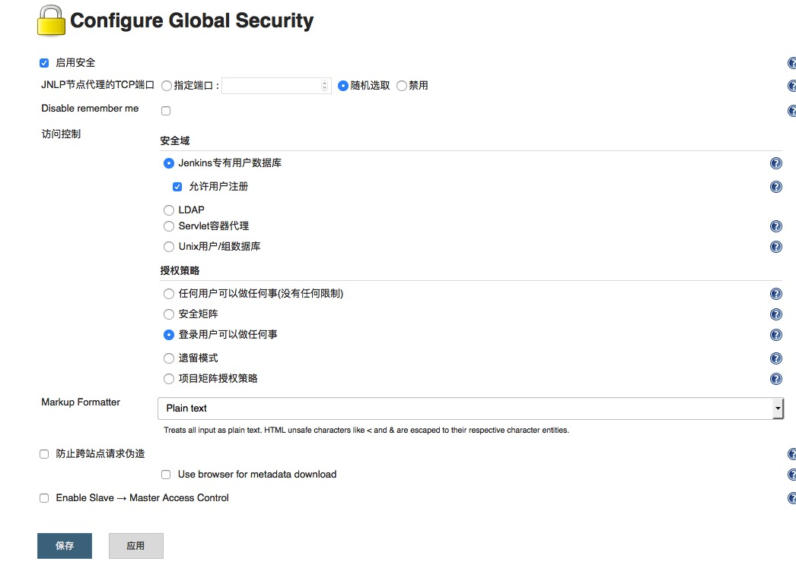


 首次设置完点击保存，然后点击注册->登录账号，在进入该界面进行账号权限设置，如图
 
  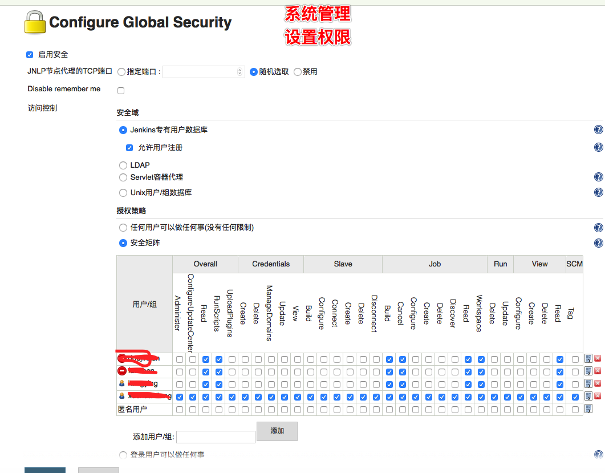

#### jenkins 系统设置
进入 ***系统管理->系统设置*** 界面：

* 首先设置一下 jenkins 内部shell 执行编码，目的当在jenkins执行shell命令时，有时候会报 utf-8 编码错误。主要是pod install的时候报错。
	
	```
	WARNING: CocoaPods requires your terminal to be using UTF-8 encoding.
	```
	设置如下：
	
	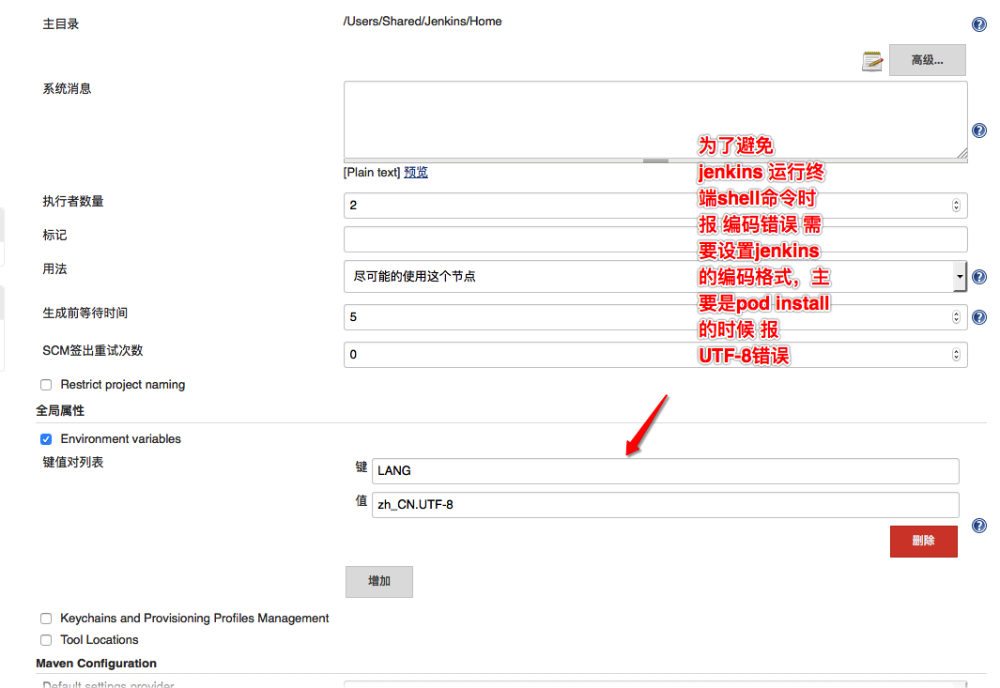
	
* jenkins Location 设置
  主要设置 jenkins 外部访问的URL 和 系统管理员的邮箱地址。用来发送 错误报告的邮箱地址：如图
  
  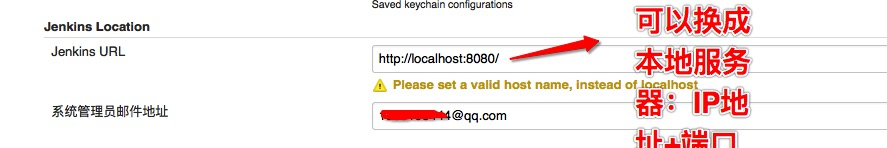
  
* 系统错误报告的邮箱设置，上面只设置了邮箱发送的地址（From地址），下面设置，邮箱的服务器，协议，邮箱，密码。如图
 	
 	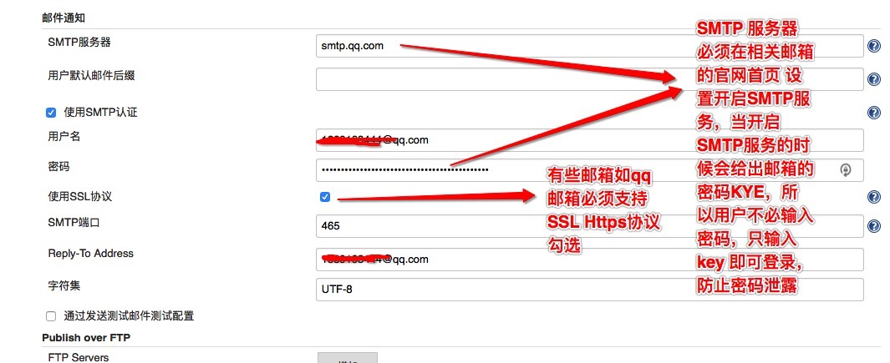
 	
## Jenkins 任务（Jobs）搭建


### 新建任务 job


  在Jenkins中，所有的任务都是以“item”为单位的。接下来我们就新建一个iOS的项目来开始自动化构建。点击“新建”，输入item的名称，选择“构建一个自由风格的软件项目”，然后点击“OK”。如图：


  
  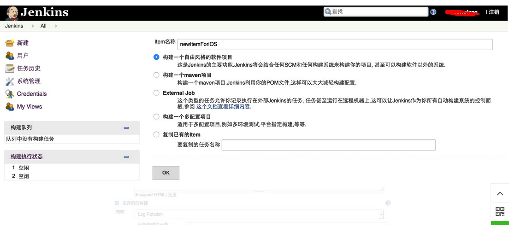


 
 设置构建信息


 
 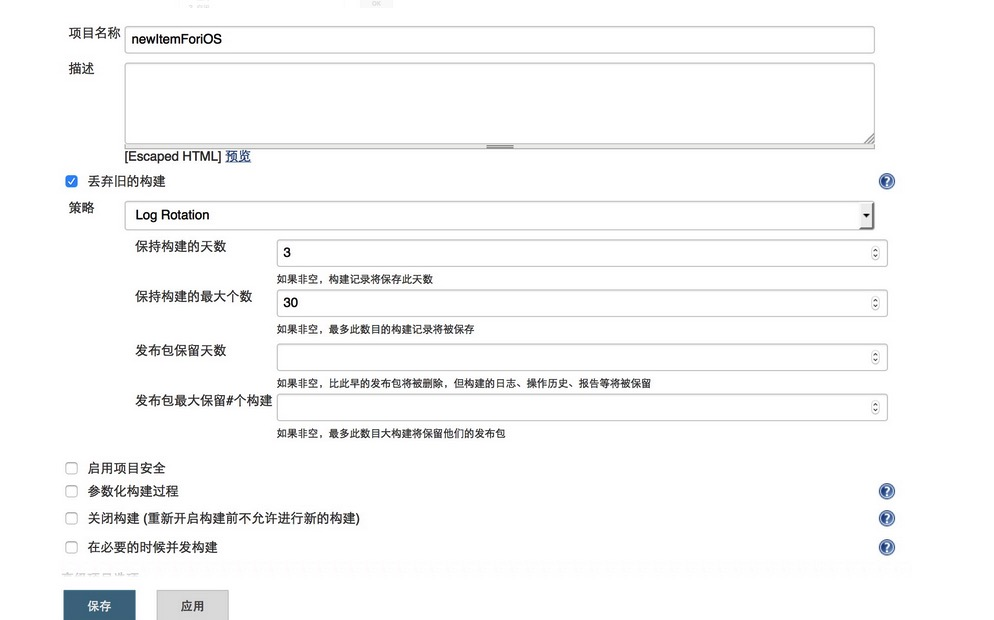


 
### 源码管理
这里用到的是GitLab，先需要配置SSH，我们可以在Jenkins的证书管理中添加SSH。在Jenkins管理页面，选择“Credentials”，然后选择“Global credentials (unrestricted)”，点击“Add Credentials”，如下图所示，我们填写自己的SSH信息，然后点击“Save”，这样就把SSH添加到Jenkins的全局域中去了。
这边需要注意的是如何获取SSH key：这个问题需要参考 gitLab 上配置SSH 的方法。

1. 查看是否已经有了ssh密钥：cd ~/.ssh，如果没有密钥则不会有此文件夹，有则备份删除
2. 生成密钥：`$ ssh-keygen -t rsa -C “haiyan.xu.vip@gmail.com”` 生成过程中必须设置秘钥密码 否则jenkins 设置会不成功。最后得到两个文件：id_rsa和id_rsa.pub
3. 添加密钥到SSH ：`ssh-add 文件名` 需要输入管理密码
4. 在gitlab 上添加 ssh 密钥，这里添加的是 "id_rsa.pub"里面的公钥。
5. 在jenkins上配置密钥到SSH ，这里添加的是id_rsa里面的私钥。具体设置如图所示：

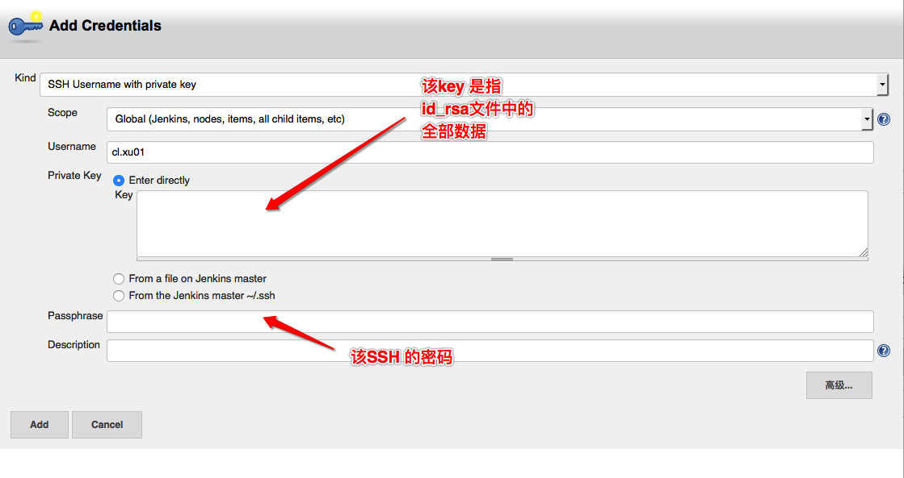

接下来，我们再回到刚刚新建的任务中，在源码管理中，选择Git，按下图填好相关信息。PS：Credentials不需要选择。如图

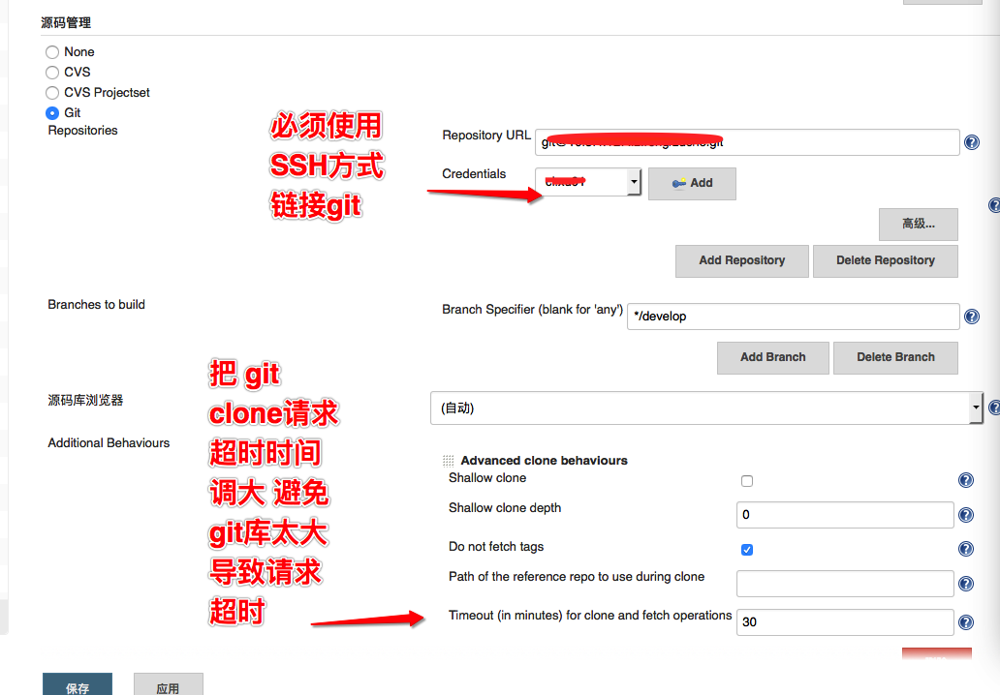

### 构建触发器设置


该设置主要是为了实现自动触发 jenkins 构建过程 真正实现自动化设置:
这边主要处理的是 ***gitlab hook*** 的设置。主要目的是当项目中有人git push 提交过代码之后，就会自动的触发 jenkins 的本Job的构建，实现自动化打包。

1. 首选需要在gitlab 项目管理官网上设置 添加git hook 的地址：如图：该地址是jenkins 上 提示的地址 下面会提到
	 
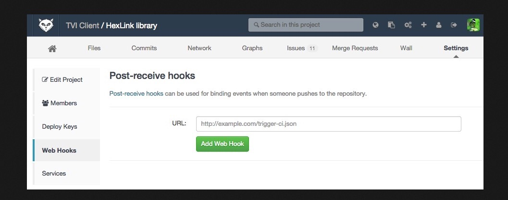

2. jenkins 上对 gitlab hook 进行相关配置 如图所示：

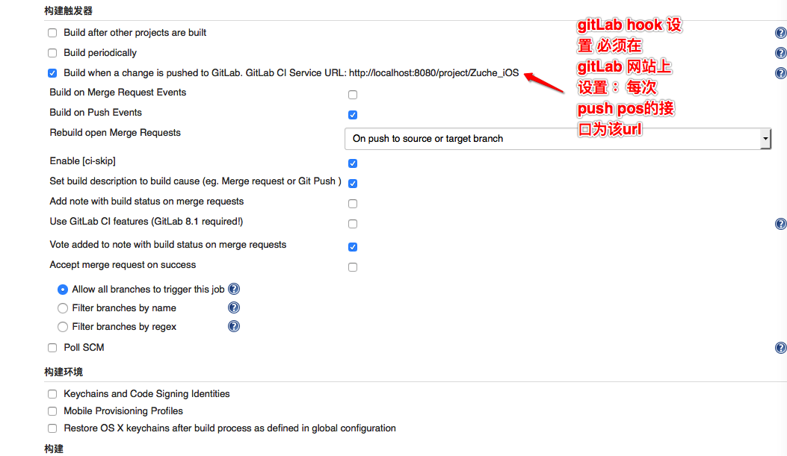

### 构建环境


在该模块中 主要设置 xcode build 打包时需要的 keychains 和 Provision Profiles 配置文件。
如果不配置 就会使用 xcode 自动的配置，来去系统中查找相应的配置，不过有一点需要注意,就是钥匙串中，登陆钥匙串中的证书 要复制到 系统钥匙串中，因为jenkins 访问的是系统中的钥匙串 这样在第一次打包的时候，会提示 是否授权访问钥匙串，点击始终允许就可以了。
注意：在电脑上安装好 xcode 配置相关的证书和配置文件，配置文件也要安装到系统目录下。
具体操作如下：从该用户目录下的所有描述文件

```
/Users/用户名/Library/MobileDevice/Provisioning Profiles
```
复制到系统目录下

```
/Library/MobileDevice/Provisioning Profiles
```

### 构建


该模块开始设置 iOS打包相关的配置。

1. 点击增加构建步骤-> Execute Shell .首先 在build 之前需要先 pod install ，并且最理想的情况是每次构建的时候 build号都改变。如图所示
	需要注意的是，使用全局变量时 必须找到绝对路径才能调用相关的命令：版本号增加[参考链接](https://www.5288z.com/?p=1651)
	
	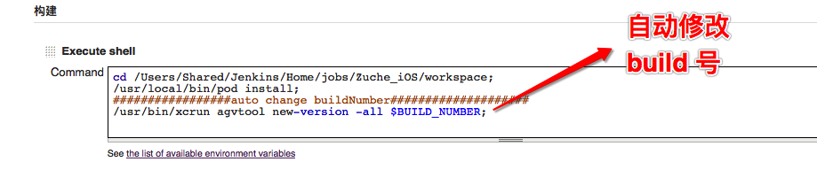
	
2.  点击增加构建步骤 xcode ，具体配置如图：
	  该配置中需要注意 在OS X 10.10.XX版本 jenkins xcode 插件不支持 生成ipa文件，但 OS X 10.11 支持 这个时候 需要手动进行打包，具体的就是在build 完成之后 添加EXecute Shell ，利用shell脚本打包：代码如下：
	  
	  ```
	  xcrun -sdk iphones PackageApplication -v [工程目录] -o [ipa输出目录]/xx.ipa
	  ```
	  
	  
	  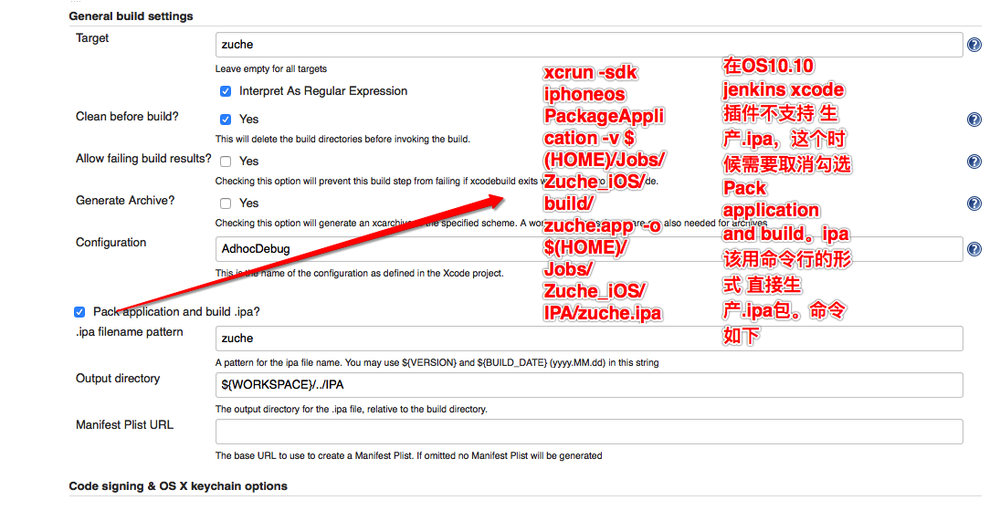
	  
3. Code signing & OS X keychain options 配置：如图
   
   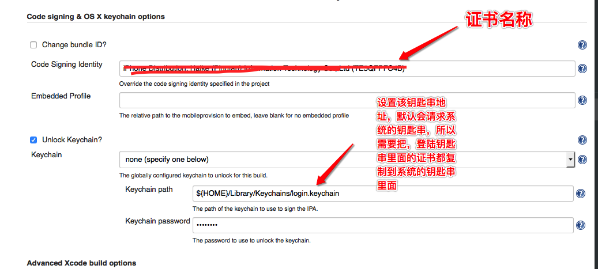
	
4. Advanced Xcode build options 配置：如图
	 
	 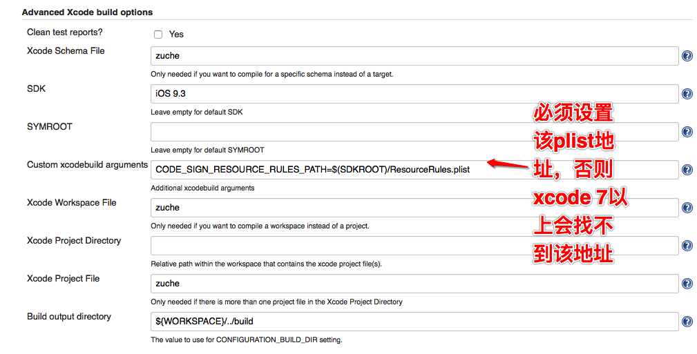

### 构建后操作


 打包完成之后 需要执行 上传到蒲公英 和 发送邮件 通知开发人员。
   具体操作我用python写的脚本来完成此功能：需要的童鞋可以去github上下载：在文章最后！！
   具体调用如图：
    
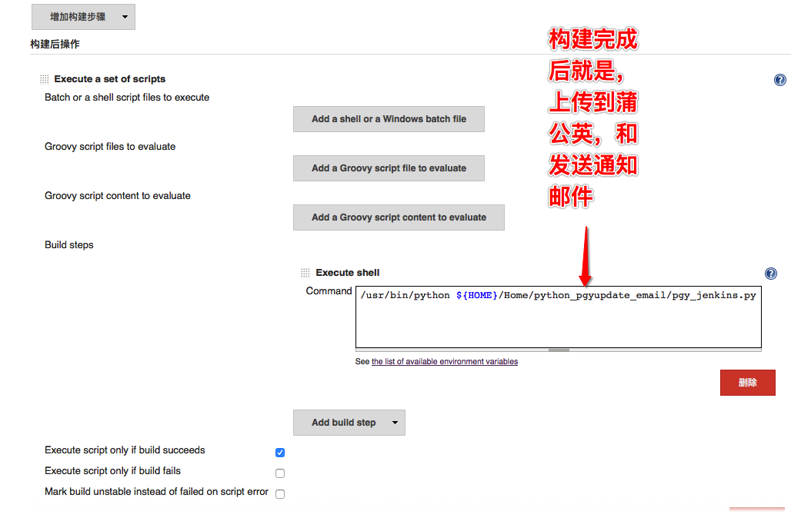
  
  最后设置 通知邮件 E-mail Notification 填写接受邮箱即可 每次构建失败都会发生邮件通知！！！
 
  
 [python 脚本地址](https://github.com/RunningYoung/jenkins-pgy-python)!!! 不要吝啬 star！！！不胜感激！！！ 

	
 
 
 

